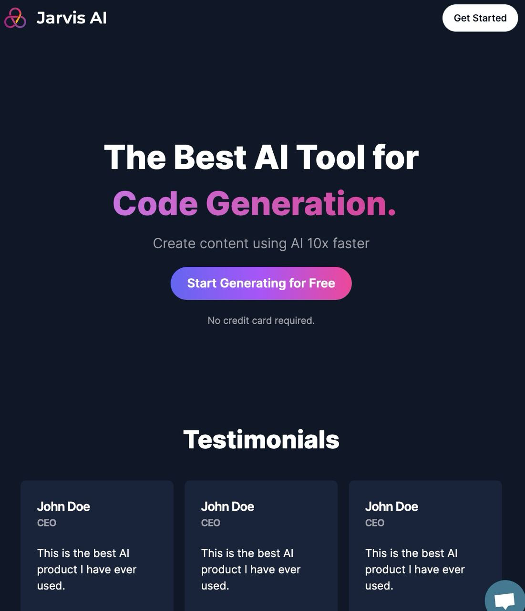
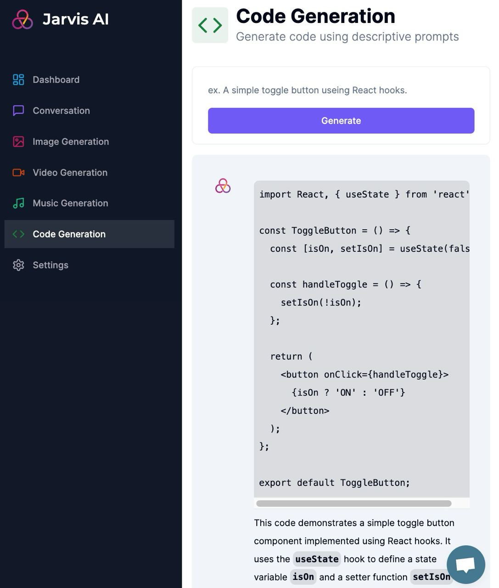

This is a [Next.js](https://nextjs.org/) project bootstrapped with [`create-next-app`](https://github.com/vercel/next.js/tree/canary/packages/create-next-app).

The UI is [Shadcn UI](https://ui.shadcn.com/), a dark mode compatible, accessible, and customizable theme for [Tailwind CSS](https://tailwindcss.com/).

AI generation capabilities are provided by [OpenAI's API](https://openai.com/blog/openai-api/) and [Replicate](https://replicate.com/).

The project is hosted on [Vercel](https://jarvis-a-i.vercel.app/).

After changing the provider in the Prisma schema, run
`npx prisma generate` to update Prisma Client code, and `npx prisma migrate dev --preview-feature` to update database schema.

Kudos to [Antonio](https://www.codewithantonio.com/mentorship) for his invaluable tutorials, which played a crucial role in making this project possible.
